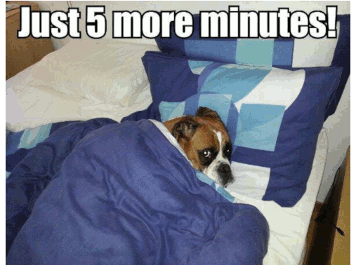

# NeverSnoozeAgain

## Inspiration
"5 more minutes Mom!" 
Waking up is hard and when you're supposed to study it is even harder.
**NeverSnoozeAgain** is a clever and innovative solution to force you to get your ass out of bed.
By limiting the time that you have to defuse the alarm, you really have to get up. 
Otherwise it will donate monaaay.
A lot of monaaayy.

## What it does
Set up an alarm using our android app at the time you want/have to wake up. 
To defuse the alarm, you can select different challenges that you have to complete within a configurable time limit.
If you don't manage to solve the challenges in time or you make a mistake, **NeverSnoozeAgain** will automatically transfer a pre-configured amount of money to a random charity organization, or the one of your choice.

## How we built it
The system is composed of an android application written in Kotlin.
The back-end is implemented on the Google Cloud Platform in Go.
The challenges are made of several wireless nodes built with ESP8266s.

## Challenges we ran into
- We had to learn Kotlin.
- We had to learn Go.
- We had to learn how to use Google Cloud Platform.
- We had to design and build physical "defuse" challenges.

## Accomplishments that we're proud of
**NeverSnoozeAgain** employs a highly scalable and modular architecture.
It is absolutely unsnoozeable. Once the alarm goes off, you really have to get up and solve the challenges in time.

## What we learned
- We learned Kotlin.
- We learned Go.
- We learned how to use the Google Cloud Platform and Google Datastore.

## What's next for NeverSnoozeAgain
- Making the App pretty! 
- Handle recurring alarms.
- Give the possibility to add charities.

